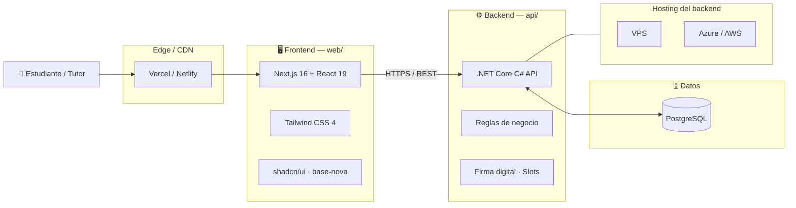

# AuraLearn — Plataforma de Tutorías Universitarias

> Red #1 de tutorías universitarias verificadas en Centroamérica (UCR · TEC · UNA · LEAD).  
> Conecta estudiantes con docentes certificados para sesiones 1-a-1 online con pizarra digital y pago en colones (SINPE Móvil) o dólares.

---

## 🧱 Arquitectura del monorepo

Este repositorio es un **monorepo** con tres componentes bien separados, cada uno con su propio stack, ciclo de despliegue y reglas de responsabilidad:



### 🖥️ Frontend — Next.js / React + Tailwind CSS
**Ubicación:** [`web/`](./web)

- **Responsabilidad única:** pintar la interfaz, capturar los clics del usuario y ofrecer una experiencia fluida.
- **No** ejecuta reglas de negocio, **no** accede directo a la base de datos, **no** valida pagos. Esos son trabajos del backend.
- Stack: Next.js 16 (App Router), React 19, Tailwind CSS 4, shadcn/ui sobre `base-nova`, Material Symbols.
- **Despliegue:** Vercel o Netlify (build estático/SSR).

### ⚙️ Backend — .NET Core C# API
**Ubicación:** [`api/`](./api)

- **Responsabilidad:** recibe las peticiones del frontend, aplica las **reglas de negocio** (valida que la firma digital del comprobante SINPE sea correcta, que el *slot* horario no esté ocupado, que el tutor tenga credenciales verificadas, que el estudiante no haya reservado fuera de horario) y persiste la información.
- Stack: .NET Core (C#), Entity Framework, JWT para autenticación, FluentValidation.
- **Despliegue:** VPS (Linux con `systemd`/`nginx`) o App Service en Azure o Elastic Beanstalk en AWS.

### 🗄️ Base de datos — PostgreSQL
- **Responsabilidad:** ser la **bóveda segura** de toda la información transaccional (usuarios, sesiones, pagos, reseñas, atestados).
- Alojada en el mismo host del backend (VPS) o como **Azure Database for PostgreSQL Flexible Server** / **Amazon RDS for PostgreSQL** cuando se despliega en la nube.
- Las migraciones se ejecutan al arrancar el backend con `dotnet ef database update`.

---

## 📂 Estructura del repositorio

```
.
├── api/              # ⚙️ Backend .NET Core C# API
├── portal/           # 🌐 Portal público (Next.js, separado de web/)
├── web/              # 🖥️ Frontend Next.js principal de la app
├── design/           # 🎨 Assets de diseño (Stitch, Figma exports)
├── .gitignore        # Ignores comunes del monorepo
└── README.md         # Este archivo
```

| Carpeta | Stack | Estado actual |
|---------|-------|----------------|
| `api/` | .NET Core | Reservada (`.gitkeep`); pendiente de implementar |
| `portal/` | Next.js | Reservada (`.gitkeep`); pensada para un portal público separado |
| `web/` | Next.js + Tailwind + shadcn | **Activo** — landing + directorio `/tutores` |
| `design/` | HTML/PNG/PS1 | Assets exportados desde Stitch |

---

## 🚀 Cómo empezar (desarrollo local)

### 1. Frontend (`web/`)
```bash
cd web
npm install
npm run dev          # http://localhost:3000
npm run build        # build de producción
npm run lint         # eslint
```

### 2. Backend (`api/`)
```bash
cd api
dotnet restore
dotnet build
dotnet run           # http://localhost:5000 (por defecto)
dotnet ef database update
```

### 3. Variables de entorno

Configura los secretos en archivos `.env.local` (frontend) y `appsettings.Development.json` (backend). **Nunca** subas secretos al repo — usa Azure Key Vault o equivalentes en producción.

---

## 🔐 Convenciones del repo

- **Conventional Commits** en los mensajes (`feat:`, `fix:`, `chore:`, `docs:`, etc.).
- `api/` y `portal/` están reservadas con `.gitkeep` porque Git no versiona carpetas vacías.
- Cada subproyecto mantiene su propio `.gitignore` anidado (Node, .NET, Python) y hereda los ignores comunes del `.gitignore` raíz.
- Sin secretos en el repo: `.env` y `appsettings.*.json` (excepto `appsettings.json`) están ignorados.

---

## 📜 Licencia

© AuraLearn, S.A. · Todos los derechos reservados.
